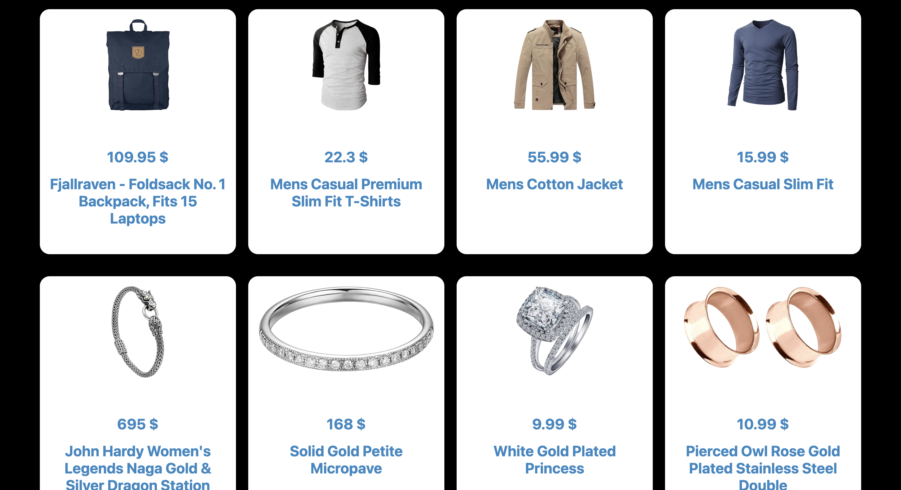

# Clothify 👕🛍️

Clothify is a simple React-based product browsing application built to practice and understand modern frontend concepts such as **React Router v6**, **Context API**, and **API data handling**.

This project focuses on clean routing, global state management, and dynamic product detail pages.

--------------------------------------------------

## 🌐 Live Demo

https://clothify-react-azure.vercel.app/

--------------------------------------------------

## 🚀 Features

- Product listing page
- Dynamic product detail page
- Client-side routing with React Router v6
- Global product data using Context API
- API integration using Axios
- Clean and minimal UI

--------------------------------------------------

## 🛠️ Tech Stack

- React
- React Router DOM (v6)
- Context API
- Axios
- JavaScript (ES6+)
- CSS

--------------------------------------------------

## 📁 Project Structure

src/
│
├── Pages/
│   ├── Home.jsx
│   ├── Products.jsx
│   └── ProductDetails.jsx
│
├── Context/
│   └── ProductContext.jsx
│
├── App.jsx
└── main.jsx

--------------------------------------------------

## 🧭 Routes Overview

/                         → Home  
/products                 → Products  
/products/product/:id     → Product Details  

--------------------------------------------------

## ▶️ Getting Started

1) Clone the repository
```
git clone https://github.com/dev-hamza03/clothify-react.git
```

3) Install dependencies
```
npm install
```

5) Run the development server
```
npm run dev
```

Open http://localhost:5173 in your browser.

--------------------------------------------------

## 📸 Screenshot




--------------------------------------------------

## 🎯 Learning Objectives

- Understand React Router and dynamic routes
- Practice Context API for global state
- Work with external APIs
- Improve component structure and data flow
- Build confidence with real-world React patterns

--------------------------------------------------

## 📌 Notes

- This is a learning-focused project
- Not intended for production use
- UI kept simple to focus on core concepts

--------------------------------------------------

## 👨‍💻 Author

Hamza Khan  
Frontend Developer (Learning React ⚛️)  
Consistency • Discipline • Growth

--------------------------------------------------

## ⭐ Feedback

Suggestions and improvements are welcome.
Learning never stops 🚀
